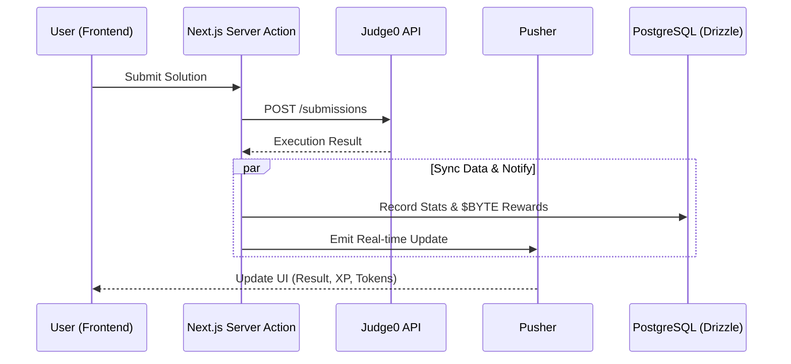

<div align="center">
    
    <div style="margin: 20px 0; padding: 20px; background: linear-gradient(135deg, #667eea 0%, #764ba2 100%); border-radius: 10px;">
        <h3 style="color: white; margin: 0; font-size: 1.3em;">🚀 Transform Your Coding Journey with Gamified Learning</h3>
        <p style="color: #f0f0f0; margin: 10px 0 0 0;">Master DSA through interactive challenges, blockchain rewards, and real-time PvP</p>
    </div>
</div>

<p align="center">
  <b>Quick Links:</b> 
  <a href="https://brainbytes.vercel.app">Live Demo</a> • 
  <a href="./documentation/SETUP.md">Setup Guide</a> • 
  <a href="#architecture">Technical Maps</a> • 
  <a href="./CONTRIBUTING.md">Contribute</a>
</p>

<p align="center">
  
  
  
</p>


---

## 🏗️ Technical Architecture

### ⚔️ PvP Challenge Flow (Real-time)
BrainBytes uses a distributed architecture to handle code execution and real-time updates.



---

## ⛓️ Web3 Integration Map

How the platform interacts with the **Sepolia Testnet** for rewards.

### 🔗 Architecture Overview

| Layer     | Component                 | Description                                                     |
|----------|---------------------------|-----------------------------------------------------------------|
| Provider | Wagmi / RainbowKit        | Manages wallet connections and Web3 hooks                      |
| Logic    | Ethers.js / Hardhat       | Handles smart contract interaction and gas management          |
| Contract | ByteToken (ERC-20)        | Deployed on Sepolia for gamified token minting and rewards     |


---

## 📂 Project Structure

Simplified view of the **BrainBytes** modular architecture.

### 🧱 Directory Overview

```plaintext
├── src/
│   ├── app/            # Next.js App Router (Pages & Layouts)
│   ├── components/     # UI components (shadcn/ui)
│   ├── actions/        # Server Actions (Logic & Mutations)
│   ├── db/             # Drizzle ORM Schema & Migrations
│   ├── lib/            # Shared utilities (Pusher, Auth0, Wagmi)
│   └── contracts/      # Solidity Smart Contracts (Hardhat)
├── documentation/      # Modular Documentation 📄
└── scripts/            # Database Seeding & Deployments
```
 

---

## 📚 Technical Deep Dives
To make it easier for contributors, we have moved detailed specs to the `documentation/` folder:
* **🚀 [Installation & Setup](documentation/SETUP.md) -** Get the project running locally.
* **🔐 [Security Architecture](./SECURITY.md) -** Auth0 patterns & CI/CD scanning.
* **📚 [Learning Curriculum](documentation/LEARNING_PATHS.md) -** Python/JS DSA path details.
* **🔄 [CI/CD Pipelines](documentation/PIPELINES.md) -** GitHub Actions workflows.


---

## 🤝 Contributing
We love community help! Check our [Contributing Guide](./CONTRIBUTING.md) for **ECWOC'26** guidelines.

<div align="left"> <h2>💙 Contributors</h2>  </div>

<p align="center">MIT Licensed | © 2024-2026 Gaurav Karakoti</p>
